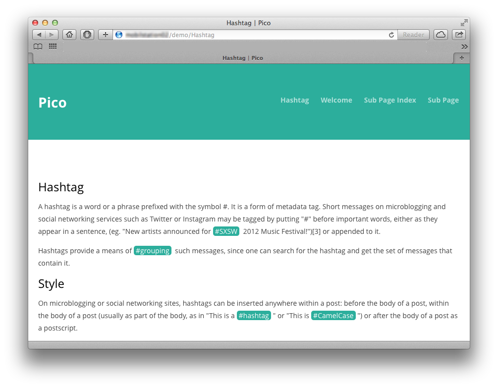

HashTag
=============================================================================

Released under the [MIT license](http://opensource.org/licenses/MIT). Copyright (c) 2013 mcbSolutions.at

**Version** 0.2; Please report errors.

**Highlites #hashtags in your site**

Installation
=============================================================================
1. Copy/save the plugin into `plugins` folder
2. Format `.hashtag` class in your css file

style.css
-----------------------------------------------------------------------------
    .hashtag {
       margin-left: 0.3em;
       margin-right: 0.3em;
       background-color:#2EAE9B;
       padding-left: 0.3em;
       padding-right: 0.3em;
       color:white;
       -moz-border-radius: 5px;
       border-radius: 5px;
    }

Optional: config
-----------------------------------------------------------------------------

### mcb_hashtag_se
**url**
Url to the search engine where HashTag is able to apply the hashtag to search for.
Use this parameter, if you like to link hashtags to a search engine other than twitter.com

	$config['mcb_hashtag_se'] = "https://www.google.com/search?q=";

### mcb_hashtag_remove_hash
**bool**
Set to `true`, if you like to remove the hash from the output.
Default is `false`.

	$config['mcb_hashtag_remove_hash'] = true;

Screenshot
=============================================================================
