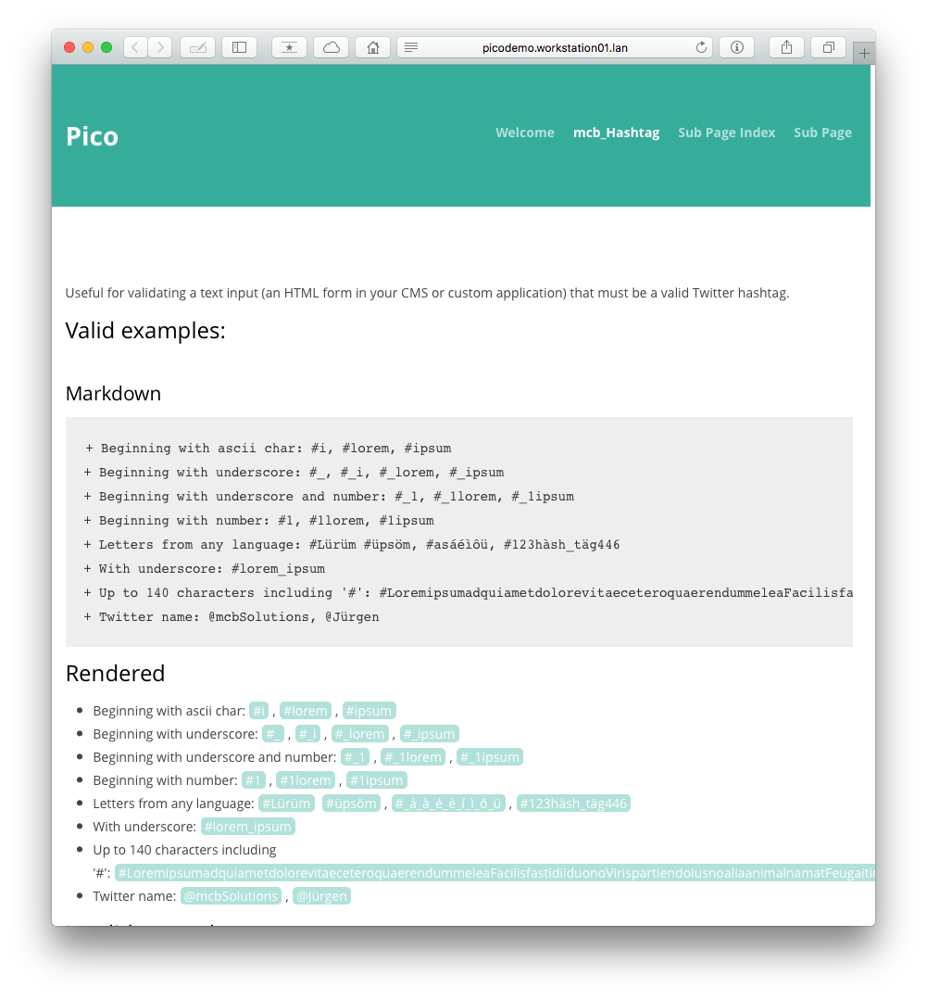

HashTag
======================================================================

Released under the [MIT license](http://opensource.org/licenses/MIT). Copyright (c) 2013 mcbSolutions.at

**Version** 0.5; Please report errors.

**Highlites #hashtags in your site**

Known bugs
======================================================================
+ Letters for all languages not working properly. Added workaround for `äöüÄÖÜáàéèìíóòúùâêîôû`

Installation
======================================================================
1. Copy/save the plugin into `plugins` folder
2. Format `.hashtag` and the `.twitteraccount` class in your css file
3. **Optional:** Copy `Test.md` to the content folder for see in action

style.css
-----------------------------------------------------------------------------
~~~~{.css}
.hashtag, .twitteraccount {
   margin-left: 0.3em;
   margin-right: 0.3em;
   background-color:#2EAE9B;
   padding-left: 0.3em;
   padding-right: 0.3em;
   color:white;
   -moz-border-radius: 5px;
   border-radius: 5px;
}

.twitteraccount {
	background-color:lightblue;
}
~~~~

Optional: config
-----------------------------------------------------------------------------

### mcb_hashtag_se
**url**
Url to the search engine where HashTag is able to apply the hashtag to search for.
Use this parameter, if you like to link hashtags to a search engine other than twitter.com

	$config['mcb_hashtag_se'] = "https://www.google.com/search?q=";

### mcb_hashtag_remove_hash
**bool**
Set to `true`, if you like to remove the hash from the output.
Default is `false`.

	$config['mcb_hashtag_remove_hash'] = true;

### mcb_hashtag_lang
**string**
Language to display the user account at twitter.com.
Default is `de`

	$config['mcb_hashtag_lang'] = "en";

Screenshot
======================================================================
