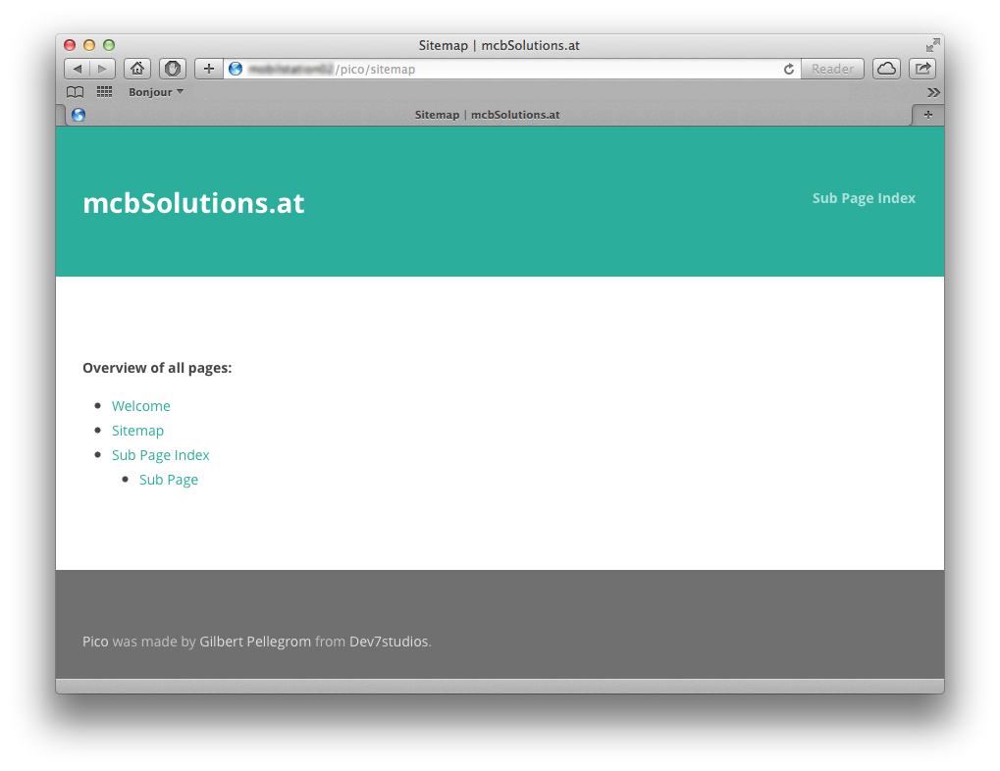

Html Sitemap
======================================================================

Released under the [MIT license](http://opensource.org/licenses/MIT). Copyright (c) 2013 mcbSolutions.at

**Version** 0.4; Please report errors.

**Generates a html sitemap for all pages.**

Installation
======================================================================
1. Copy/save the plugin into `plugins` folder
2. If you like to add text before, create a file called `Sitemap.md` or `sitemap.md`.
3. Add the levels to your stylesheet

        .level1{margin-left: 0;}
        .level2{margin-left: 0.5em;}
        .level3{margin-left: 1em;}
        .level4{margin-left: 1.5em;}
        .level5{margin-left: 2em;}
        .level6{margin-left: 2.5em;}

Optional: config
-----------------------------------------------------------------------------

### mcb_HtmlSitemap_show_hidden
**boolean**  
Activate hidden pages within the Sitemap. Default is `false`

	$config['mcb_HtmlSitemap_show_hidden'] = true;

### mcb_HtmlSitemap_hidden_folder
**string**  
Folder containing hidden pages without directory seperator. Default is `hidden`

	$config['mcb_HtmlSitemap_hidden_folder'] = "hidden";

Screenshot
======================================================================
