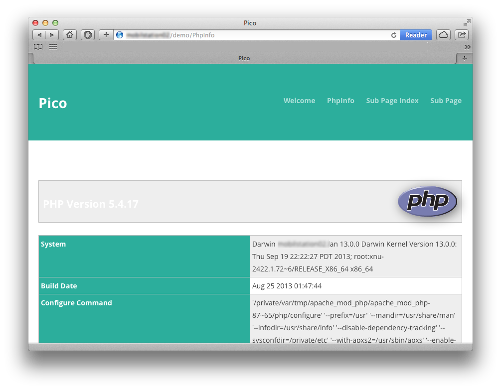

PHP Info
===============================================================

Released under the [MIT license](http://opensource.org/licenses/MIT). Copyright (c) 2013 mcbSolutions.at

**Version** 0.5; Please report errors.

**Displays the `phpinfo(...)` and `phpcredits(...)` within you site.**

**Attention** From version 0.4 to 0.5 the name of the config variable has been changed from `mcb_use_section` to `mcb_PhpInfo_use_section`.

Installation
===============================================================
1. Copy/save the plugin into `plugins` folder
2. If you like to add text before, create a file called `phpinfo.md` or `PhpInfo.md`.
3. If you like to modify the styles: I wrapped a `
` around the phpinfo().
   (see style.css for an example) or simply include
   `<link rel="stylesheet" href="{{ base_url }}/plugins/mcb_PhpInfo/style.css" media="screen,projection,print">`
   in your templates head tag

Optional: Config
-----------------------------------------------------------------------------

### mcb_PhpInfo_use_section
**boolean**

Activate navigation to sections. When set to false (default) all information from phpinfo() will be displayed.

	$config['mcb_PhpInfo_use_section']		= false;
	

Screenshot
===============================================================
