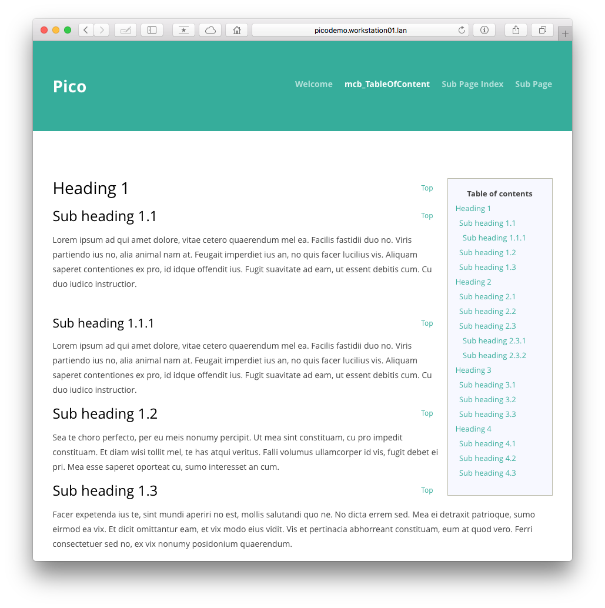

Table Of Contents
======================================================================

Released under the [MIT license](http://opensource.org/licenses/MIT). Copyright (c) 2013 mcbSolutions.at

**Version** 0.3; Please report errors.

**Generates a table of contents for the current page.**

Installation
======================================================================
1. Copy/save the plugin into `plugins` folder

index.html
-----------------------------------------------------------------------------
1. Add 
		
		<link rel="stylesheet" href="{{ base_url }}/plugins/mcb_TableOfContent/style.css" media="screen,projection,print">
		<link rel="stylesheet" href="{{ base_url }}/plugins/mcb_TableOfContent/print.css" media="print">
		
	in the `head` section of your layout file.
2. **Optional - Smooth scrolling:** Add 
		
		` after `
		
	inside the `head` section.
2. Add `{{ mcb_toc_top }}` directly after the `body` tag.
3. Add `{{ mcb_toc }}` where you want the table of contents displayed.
    
Optional: Config
-----------------------------------------------------------------------------

### mcb_toc_depth
**integer**

Only display header h1 to h`n` (where `n` is 1-6). Default is `3`.

	$config['mcb_toc_depth']		= 3;
	
### mcb_toc_min_headers
**integer**

Only generate Table of content with at least `n` headers. Default is `3`.

	$config['mcb_toc_min_headers']	= 3;	
	
### mcb_toc_top_txt					
**string**

Text to display for "Move to top". Default is `Top`.

	$config['mcb_toc_top_txt']		= 'Top';				
	
### mcb_toc_caption
**string**

Text to display as caption for the table of contents. Default is `Table of contents`.

	$config['mcb_toc_caption']		= 'Table of contents';

Screenshot
=============================================================================
